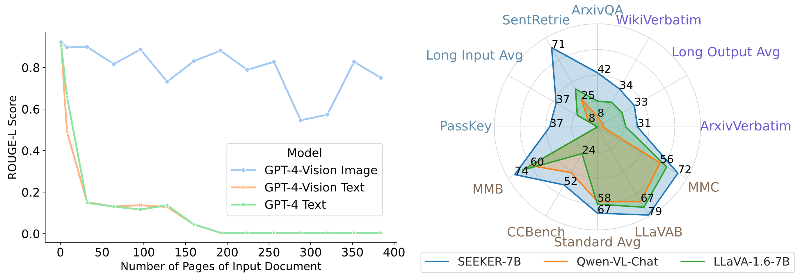
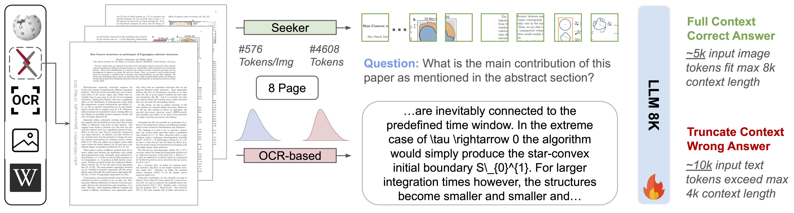
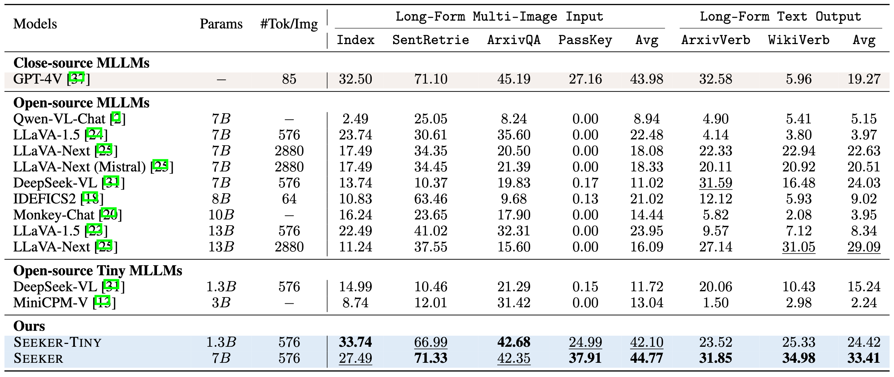
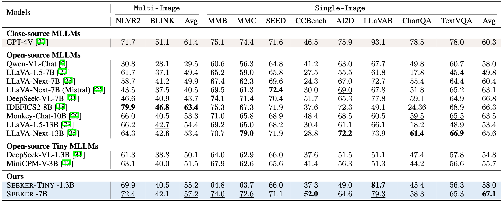
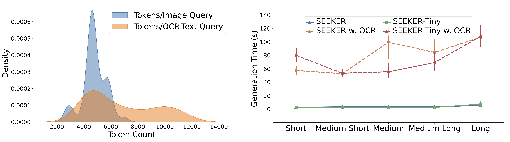

# From Text to Pixel: Advancing Long-Context Understanding in MLLMs

   📃 <a href="https://arxiv.org/abs/2405.14213" target="_blank">Paper</a> 

We introduce SEEKER, a multimodal large language model designed to tackle this issue. SEEKER aims to optimize the compact encoding of long text by compressing the text sequence into the visual pixel space via images, enabling the model to handle long text within a fixed token-length budget efficiently.</a>.

## Overview
Left: Performance plot on First-Sentence-Retrieval task revealing compact nature of image tokens in representing long content. Right: Radar chart demonstrating the superior performance of the SEEKER (ours) model across both short and long-context multimodal tasks.

</img>

Our SEEKER surpass OCR-based model on long multimodal context tasks: 1) process multiple text-rich images naturally. 2) more compact token and fit easily in fix-context length LLM.

</img>

Main quantitative results - Long Image and Text Context.

</img>

Main quantitative results - Short Image and Text Context.

</img>

Compact Context Length and Inference Efficiency

</img>

## Training and Inference
**To Be Released**
